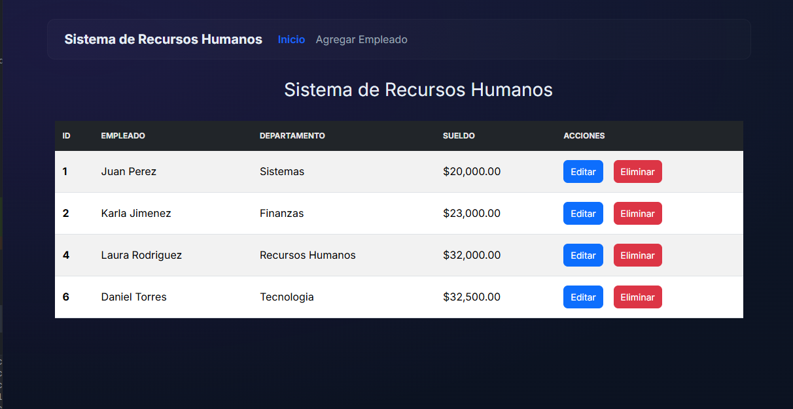
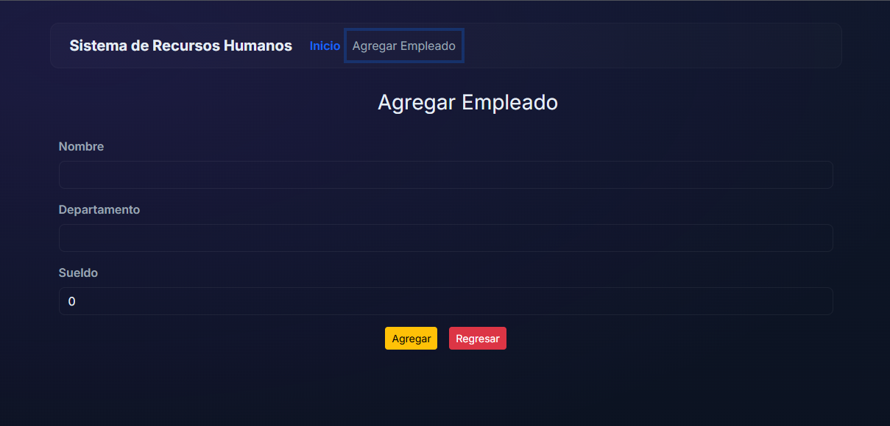
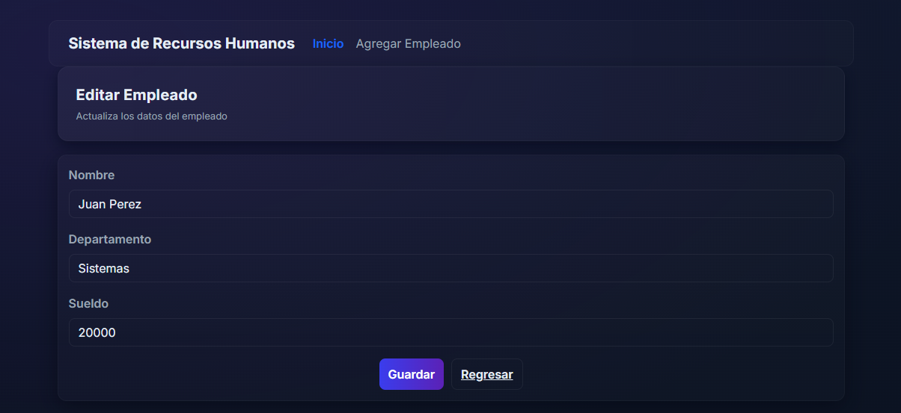

# Human Resources System - Full Stack Spring Boot + React

A complete employee management platform featuring CRUD operations, a responsive dark UI, and clean professional documentation. Designed for clarity, performance, and a smooth developer experience.

## 🚀Features

- Employee management (Create, Read, Update, Delete)

- Salary formatting with currency support

- Integrated validation and error handling

- Responsive dark-themed interface

- Clean API structure using Spring Boot 3.3+

- Fully documented → JavaDoc (backend) & JSDoc (frontend)

- Fast development environment with Vite + H2 Database

## 🛠Tech Stack

### Backend
- Java 17
- Spring Boot 3.3+
- Spring Data JPA
- H2 Database (in-memory)

### Frontend
- React 18 + Vite
- React Router v6
- Axios
- Bootstrap 5 + custom CSS

## 📸Screenshots

### Employee List


### Add Employee


### Edit Employee



## 🧱 Architecture Overview

The project follows a clean full-stack architecture, separating frontend UI components from backend business logic.
The backend exposes REST endpoints, and the frontend interacts with them through Axios.

### 📂 Backend Architecture (Spring Boot)

    src/main/java/gm/rh
    │
    ├── controlador/              # REST controllers
    │   └── EmpleadoControlador
    │
    ├── excepcion/                # Custom exception handling
    │   └── RecursoNoEncontradoExcepcion
    │
    ├── modelo/                   # JPA entities
    │   └── Empleado
    │
    ├── repository/               # Spring Data JPA repositories
    │   └── EmpleadoRepository
    │
    ├── service/                  # Business logic layer
    │   ├── EmpleadoServicio
    │   └── IEmpleadoServicio
    │
    └── RhApplication             # Main Spring Boot application

### 🔎 Backend Flow 
    
    Controller → Service → Repository → H2 Database

### 📂 Frontend Architecture (React + Vite)

    src/
    │
    ├── empleados/                # CRUD views
    │   ├── AgregarEmpleado.js
    │   ├── EditarEmpleado.js
    │   └── ListadoEmpleados.js
    │
    ├── plantilla/                # Reusable layout components
    │   └── Navegacion.js
    │
    ├── App.js                    # Main router
    ├── index.js                  # Entry point
    └── index.css                 # Global styles

### 🔎 Frontend Flow

    React Router → UI Components → Axios → REST API

## 📊 System Architecture Diagram

               ┌────────────────────────┐
               │        React App       │
               │  (Axios, React Router) │
               └─────────────┬──────────┘
                             │
                             ▼
               ┌────────────────────────┐
               │     Spring Boot API    │
               │ Controller | Service   │
               │     Repository Layer   │
               └─────────────┬──────────┘
                             │
                             ▼
               ┌────────────────────────┐
               │       H2 Database      │
               └────────────────────────┘

##📦 Dockerization Overview

This project includes full containerization for:

### - Backend (Spring Boot)
Multi-stage build producing a lightweight production JAR image.

### - Frontend (React + Vite)
Built and served with nginx:alpine for production.

### - MySQL Database
Persistent storage using Docker volumes.

### - docker-compose.yml
Orchestrates all services into a stable production stack.

    services:
      mysql-rh        → MySQL 8
      hr-backend      → Spring Boot REST API
      hr-frontend     → React app served by Nginx


Application URLs after startup:

Service              URL
Frontend	        http://localhost:3000

Backend API	        http://localhost:8080/rh-app

## ▶ How to Run (Dockerized)
### 1️⃣ Build & Start All Services

Inside the project root:

    docker compose up --build


This will automatically:

- Build backend JAR

- Build React frontend and bundle it

- Serve frontend via Nginx

- Initialize MySQL

- Start all services in correct order

##  ▶ How to Run Without Docker (Development Mode)

### Backend

```bash
cd Spring
./mvnw spring-boot:run
```

API: http://localhost:8080/rh-app

## Frontend

```bash
cd react
npm install
npm run dev
```

App: http://localhost:3000

## 🚧 Future Improvements (Roadmap)

### Backend

- Add pagination for /empleados

- Add query filters (salary, last name, etc.)

- Implement authentication (JWT or Basic Auth)

- Integrate Swagger/OpenAPI documentation

- Move from H2 to PostgreSQL/MySQL for production

### Frontend

- Add delete confirmation modals

- Use Formik + Yup for advanced validation

- Add global loading indicators

- Integrate React Query for data caching

- Add theme switcher (Dark/Light mode)

### DevOps

- Docker image versioning

- Monitoring/health endpoints

- CI/CD using GitHub Actions

### Testing

- Backend: JUnit + Mockito

- Frontend: Jest + React Testing Library

## 👤 Author

Made with passion by Daniel Torres
If you like this project, consider giving it a ⭐ on GitHub.
